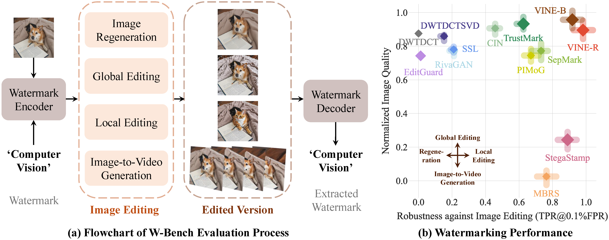
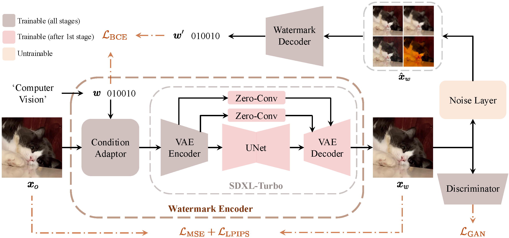

# [ICLR 2025] Robust Watermarking Using Generative Priors Against Image Editing: From Benchmarking to Advances

<!-- [](https://arxiv.org/abs/2307.12493) -->

[](https://arxiv.org/abs/2410.18775) [](https://huggingface.co/Shilin-LU) [](https://huggingface.co/datasets/Shilin-LU/W-Bench) [](https://colab.research.google.com/github/Shilin-LU/VINE/blob/main/demo_colab.ipynb)

Official implementation of [Robust Watermarking Using Generative Priors Against Image Editing: From Benchmarking to Advances](https://arxiv.org/abs/2410.18775)

> **Robust Watermarking Using Generative Priors Against Image Editing: From Benchmarking to Advances**<br>
> Shilin Lu, Zihan Zhou, Jiayou Lu, Yuanzhi Zhu, and Adams Wai-Kin Kong <br>
> ICLR 2025
> 
>**Abstract**: <br>
Current image watermarking methods are vulnerable to advanced image editing techniques enabled by large-scale text-to-image models. These models can distort embedded watermarks during editing, posing significant challenges to copyright protection. In this work, we introduce W-Bench, the first comprehensive benchmark designed to evaluate the robustness of watermarking methods against a wide range of image editing techniques, including image regeneration, global editing, local editing, and image-to-video generation. Through extensive evaluations of eleven representative watermarking methods against prevalent editing techniques, we demonstrate that most methods fail to detect watermarks after such edits. To address this limitation, we propose VINE, a watermarking method that significantly enhances robustness against various image editing techniques while maintaining high image quality. Our approach involves two key innovations: (1) we analyze the frequency characteristics of image editing and identify that blurring distortions exhibit similar frequency properties, which allows us to use them as surrogate attacks during training to bolster watermark robustness; (2) we leverage a large-scale pretrained diffusion model SDXL-Turbo, adapting it for the watermarking task to achieve more imperceptible and robust watermark embedding. Experimental results show that our method achieves outstanding watermarking performance under various image editing techniques, outperforming existing methods in both image quality and robustness.

---

</div>



---

</div>



---

<br>

</div>

## News
- **[Mar 02, 2025]** 😊 *W-Bench Release*: W-Bench has been officially released.
- **[Jan 23, 2025]** 🥳 *ICLR 2025 Acceptance*: VINE has been accepted by ICLR 2025. Check the [OpenReview page](https://openreview.net/forum?id=16O8GCm8Wn) for more details.
- **[Oct 24, 2024]** 🚀 *Checkpoint Release*: The checkpoints for VINE along with our technical report are available on [arXiv](https://arxiv.org/abs/2410.18775).

---

</div>

## Contents
  - [Setup](#setup)
    - [Creating a Conda Environment](#creating-a-conda-environment)
    - [Downloading VINE Checkpoints](#downloading-vine-checkpoints)
  - [Demo](#demo)
  - [Inference](#inference)
    - [Watermark Encoding](#watermark-encoding)
    - [Image Editing](#image-editing)
    - [Watermark Decoding](#watermark-decoding)
    - [Quality Metrics Calculation](#quality-metrics-calculation)
  - [W-Bench](#w\-bench)
    - [Download W-Bench](#1-download-w-bench)
    - [Encode the Entire W-Bench](#2-encode-the-entire-w-bench)
    - [Edit the Encoded W-Bench (or Distortion)](#3-edit-the-encoded-w-bench-or-distortion)
      - [Regeneration](#regeneration)
      - [Global Editing](#global-editing)
      - [Local Editing](#local-editing)
      - [Image to Video](#image-to-video)
      - [Traditional Distortion (Brightness, Contrast, Blurring, Noise, Compression)](#traditional-distortion-brightness-contrast-blurring-noise-compression)
    - [Decode the Entire W-Bench](#4-decode-the-entire-w-bench)
  - [Baseline Evaluation Data on W-Bench](#baseline-evaluation-data-on-w-bench)
  - [Citation](#citation)

<br>

## Setup

### Creating a Conda Environment

```shell
git clone https://github.com/Shilin-LU/VINE.git
cd VINE
conda create -n vine python=3.10
conda activate vine
pip install git+https://github.com/Shilin-LU/VINE
```

> **Tip:** Note that when editing images using MagicBrush and SVD, the environment should use the specific environments listed in their respective sections below. In all other cases, the **vine** environment is sufficient to run all code, including watermark encoding, decoding, regeneration, local editing, and other global editing tasks.

### Downloading VINE Checkpoints

Our models, VINE-B and VINE-R, have been released on HuggingFace ([VINE-B-Enc](https://huggingface.co/Shilin-LU/VINE-B-Enc), [VINE-B-Dec](https://huggingface.co/Shilin-LU/VINE-B-Dec), [VINE-R-Enc](https://huggingface.co/Shilin-LU/VINE-R-Enc), [VINE-R-Dec](https://huggingface.co/Shilin-LU/VINE-R-Dec)) and are also available for download from [OneDrive](https://entuedu-my.sharepoint.com/:f:/g/personal/shilin002_e_ntu_edu_sg/Eow35WqqamtKojEB2oX1CiUB1URh40K1xaFp-NsGPa2VBw?e=YCrnJo). 

<br>

## Demo
An interactive [Colab demo](https://colab.research.google.com/github/Shilin-LU/VINE/blob/main/demo_colab.ipynb) is available. It walks you through watermark encoding, image editing, watermark decoding, and quality metrics calculation. This demo is a starting point to familiarize yourself with the workflow.

<br>

## Inference

### Watermark Encoding
Embed a message into a single image:
```shell
python vine/src/watermark_encoding.py          \
  --pretrained_model_name Shilin-LU/VINE-R-Enc \
  --input_path ./example/input/2.png           \
  --output_dir ./example/watermarked_img       \
  --message 'Hello World!'
```

Watermark a list of images:
```shell
python vine/src/watermark_encoding_list.py     \
  --pretrained_model_name Shilin-LU/VINE-R-Enc \
  --input_dir ./example/input                  \
  --output_dir ./example/watermarked_img       \
  --message 'Your Secret'
```

Watermark the entire W-Bench:
```shell
python vine/src/watermark_encoding_wbench.py   \
  --pretrained_model_name Shilin-LU/VINE-R-Enc \
  --input_dir ./W-Bench                        \
  --output_dir ./vine_encoded_wbench           \
  --message 'Your Secret'
```

### Image Editing
Apply image editing techniques to watermarked images. For example, using [InstructPix2Pix](https://github.com/timothybrooks/instruct-pix2pix), [UltraEdit](https://github.com/HaozheZhao/UltraEdit), or Image Inversion:
```shell
python vine/src/image_editing.py                  \
  --model ultraedit                               \
  --input_path ./example/watermarked_img/2_wm.png \
  --output_dir ./example/edited_watermarked_img      
```
For batch processing and additional editing methods (e.g., InstructPix2Pix, MagicBrush), see the [W-Bench](#w\-bench) section.

### Watermark Decoding
Extract the embedded message from a watermarked image:
```shell
python vine/src/watermark_decoding.py                         \
  --pretrained_model_name Shilin-LU/VINE-R-Dec                \
  --input_path ./example/edited_watermarked_img/2_wm_edit.png \
  --groundtruth_message 'Hello World!'                    
```

Extract the embedded message from a list of images:
```shell
python vine/src/watermark_decoding_list.py     \
  --pretrained_model_name Shilin-LU/VINE-R-Dec \
  --input_path ./example/watermarked_img       \
  --groundtruth_message 'Hello World!'                    
```

Decode messages from the edited W-Bench:
```shell
python vine/src/watermark_decoding_wbench.py     \
  --pretrained_model_name Shilin-LU/VINE-R-Dec   \
  --groundtruth_message 'Your Secret'            \
  --unwm_images_dir ./W-Bench                    \
  --wm_images_dir ./output/edited_wmed_wbench    \
  --output_dir ./output/detection_results/vine_r \
  --transformation edit                          \
  --decode_wbench_raw_data n
``` 

### Quality Metrics Calculation
Evaluate watermark imperceptibility (PSNR, SSIM, LPIPS):
```shell
python vine/src/quality_metrics.py    \
  --input_path ./example/input/2.png  \
  --wmed_input_path ./example/watermarked_img/2_wm.png                   
```

### Decoding Accuracy Metrics Calculation
To compute statistical decoding metrics over a batch of images, including TPR@0.1% FPR, TPR@1% FPR, and AUROC, refer to the [W-Bench](#w\-bench) section. These metrics can be calculated using `vine/src/watermark_decoding_wbench.py`.

<br>

## W-Bench
W-Bench is our comprehensive benchmark designed to evaluate the robustness of watermarking across four image editing techniques:
- **Regeneration:** Both stochastic and deterministic (image inversion) methods.
- **Global Editing:** Methods like UltraEdit, InstructPix2Pix, and MagicBrush.
- **Local Editing:** Techniques including UltraEdit and ControlNet-Inpainting.
- **Image to Video:** Converting watermarked images into videos using Stable Video Diffusion (SVD).

The benchmark comprises 10,000 samples sourced from datasets like COCO, Flickr, and ShareGPT4V.

The images of W-Bench have been released on [HuggingFace](https://huggingface.co/datasets/Shilin-LU/W-Bench) and are also available on [OneDrive](https://entuedu-my.sharepoint.com/:f:/g/personal/shilin002_e_ntu_edu_sg/EkJ9AIBUNglEt3sRKIBNA9oBI1BNoz2IEj9iizh4uKF-3Q?e=stTbpM). Below is a detailed guide on how to use all the image editing techniques listed in W-Bench.

### 1. Download W-Bench
```shell
cd VINE
huggingface-cli download Shilin-LU/W-Bench --repo-type=dataset --local-dir W-Bench
```

### 2. Encode the Entire W-Bench
Embed watermarks into every image in W-Bench:
```shell
python vine/src/watermark_encoding_wbench.py   \
  --pretrained_model_name Shilin-LU/VINE-R-Enc \
  --input_dir ./W-Bench                        \
  --output_dir ./vine_encoded_wbench           \
  --message 'Your Secret'
```
Optionally, run quality assessments on the encoded dataset:
```shell
python vine/src/quality_metrics_wbench.py \
  --input_dir ./vine_encoded_wbench       \
  --wbench_path ./W-Bench
```

### 3. Edit the Encoded W-Bench (or Distortion)

#### Regeneration
- **Stochastic Regeneration:**
```shell
python vine/w_bench_utils/regeneration/stochastic_regeneration.py  \
  --wm_images_folder ./vine_encoded_wbench/512/STO_REGENERATION_1K \
  --edited_output_folder ./output/edited_wmed_wbench/STO_REGENERATION_1K
```

- **Deterministic Regeneration (aka, Image Inversion):**
```shell
python vine/w_bench_utils/regeneration/stochastic_regeneration.py \
  --wm_images_folder ./vine_encoded_wbench/512/DET_INVERSION_1K   \
  --edited_output_folder ./output/edited_wmed_wbench/DET_INVERSION_1K
```

---

#### Global Editing
- **UltraEdit:**
```shell
python vine/w_bench_utils/global_editing/global_editing_ultraedit.py \
  --wm_images_folder ./vine_encoded_wbench/512/INSTRUCT_1K           \
  --edited_output_folder ./output/edited_wmed_wbench                 \
  --editing_prompt_path ./W-Bench/INSTRUCT_1K/prompts.csv   
```

- **InstructPix2Pix:**
```shell
python vine/w_bench_utils/global_editing/global_editing_instructpix2pix.py \
  --wm_images_folder ./vine_encoded_wbench/512/INSTRUCT_1K                 \
  --edited_output_folder ./output/edited_wmed_wbench                       \
  --editing_prompt_path ./W-Bench/INSTRUCT_1K/prompts.csv   
```

- **MagicBrush:**

1. Setup for MagicBrush:
```shell
cd vine/w_bench_utils/global_editing
git clone https://github.com/timothybrooks/instruct-pix2pix.git
cd instruct-pix2pix
conda env create -f environment.yaml
conda activate ip2p
```
2. Download the MagicBrush Checkpoint:
```shell
mkdir checkpoints && cd checkpoints
wget https://huggingface.co/osunlp/InstructPix2Pix-MagicBrush/resolve/main/MagicBrush-epoch-52-step-4999.ckpt
```
3. Run MagicBrush Editing:
```shell
python vine/w_bench_utils/global_editing/global_editing_magicbrush.py \
  --wm_images_folder ./vine_encoded_wbench/512/INSTRUCT_1K            \
  --edited_output_folder ./output/edited_wmed_wbench                  \
  --editing_prompt_path ./W-Bench/INSTRUCT_1K/prompts.csv   
```

---

#### Local Editing

- **UltraEdit:**
```shell
python vine/w_bench_utils/local_editing/local_editing_ultraedit.py \
  --wm_images_folder ./vine_encoded_wbench/512/LOCAL_EDITING_5K    \
  --edited_output_folder ./output/edited_wmed_wbench               \
  --wbench_path ./W-Bench/LOCAL_EDITING_5K
```

- **ControlNet-Inpainting:**
```shell
python vine/w_bench_utils/local_editing/local_editing_controlnet_inpainting.py \
  --wm_images_folder ./vine_encoded_wbench/512/LOCAL_EDITING_5K                \
  --edited_output_folder ./output/edited_wmed_wbench                           \
  --wbench_path ./W-Bench/LOCAL_EDITING_5K
```

---

#### Image to Video

- **Stable Video Diffusion (SVD):**
  
1. Setup for SVD:
 
```shell
conda create -n svd python=3.8.5
conda activate svd
cd vine/w_bench_utils/image_to_video/generative-models
pip3 install -r requirements/pt2.txt
```

2. Download the SVD Checkpoint:
 
```shell
mkdir checkpoints && cd checkpoints
huggingface-cli download stabilityai/stable-video-diffusion-img2vid-xt --repo-type=model --local-dir svd_xt
```

*Alternatively, use the provided script `download_svd_ckpt.py` to download.*

3. Run Image-to-Video Conversion:

```shell
python vine/w_bench_utils/image_to_video/image_to_video_svd.py \
  --wm_images_folder ./vine_encoded_wbench/512/SVD_1K          \
  --edited_output_folder ./output/edited_wmed_wbench/SVD_raw 
```

4. Post-process Video Frames:
 
```shell
python vine/w_bench_utils/image_to_video/i2v_utils.py \
  --source_folder ./output/edited_wmed_wbench/SVD_raw \
  --target_folder ./output/edited_wmed_wbench/SVD_1K
```

---

#### Traditional Distortion (Brightness, Contrast, Blurring, Noise, Compression)
Apply all traditional distortion techniques to the entire W-Bench dataset:
```shell
python vine/w_bench_utils/distortion/distortions.py \
  --wm_images_folder ./vine_encoded_wbench          \
  --edited_output_folder ./output/distorted_wmed_wbench
```

---

### 4. Decode the Entire W-Bench
Decode watermarked messages after editing:
```shell
python vine/src/watermark_decoding_wbench.py     \
  --pretrained_model_name Shilin-LU/VINE-R-Dec   \
  --groundtruth_message 'Your Secret'            \
  --unwm_images_dir ./W-Bench                    \
  --wm_images_dir ./output/edited_wmed_wbench    \
  --output_dir ./output/detection_results/vine_r \
  --transformation edit                          \
  --decode_wbench_raw_data n
``` 

<br>

## Baseline Evaluation Data on W-Bench

We have evaluated **11 baseline watermarking methods + VINE-B + VINE-R** on the W-Bench dataset. For each baseline, the following data have been generated and saved:

- **Watermarked Images:**  
  Each baseline applied its watermarking algorithm to the entire W-Bench dataset. 

- **Edited Images:**  
  The watermarked images from all baselines were processed using every image editing method defined in W-Bench (e.g., regeneration, global editing, local editing, and image-to-video generation). 

- **Distorted Images:**  
  In addition to editing, the watermarked images were also subjected to all image distortion methods available in W-Bench. 

All the data (watermarked, edited, and distorted images) have been uploaded publicly on OneDrive for easy access and further research. You can download the full dataset using the link below:

<!-- [OneDrive Baseline Evaluation Data](https://entuedu-my.sharepoint.com/:f:/g/personal/shilin002_e_ntu_edu_sg/EkJ9AIBUNglEt3sRKIBNA9oBI1BNoz2IEj9iizh4uKF-3Q?e=stTbpM) -->
[To be updated]

> **Note:** These data are provided for research purposes only. Please cite our work if you use our code and W-Bench in your research.


<br>

## Citation
If you find the repo useful, please consider giving a star and citing:
```
@article{lu2024robust,
  title={Robust watermarking using generative priors against image editing: From benchmarking to advances},
  author={Lu, Shilin and Zhou, Zihan and Lu, Jiayou and Zhu, Yuanzhi and Kong, Adams Wai-Kin},
  journal={arXiv preprint arXiv:2410.18775},
  year={2024}
}
```
